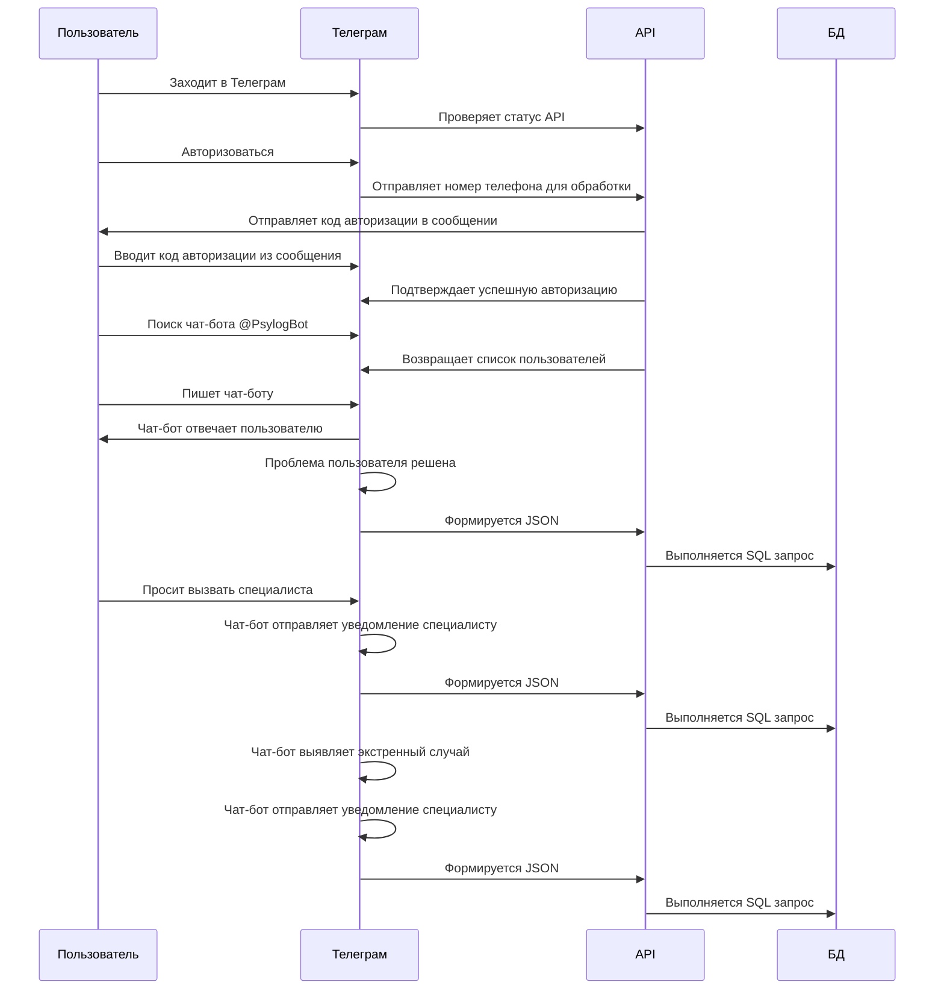
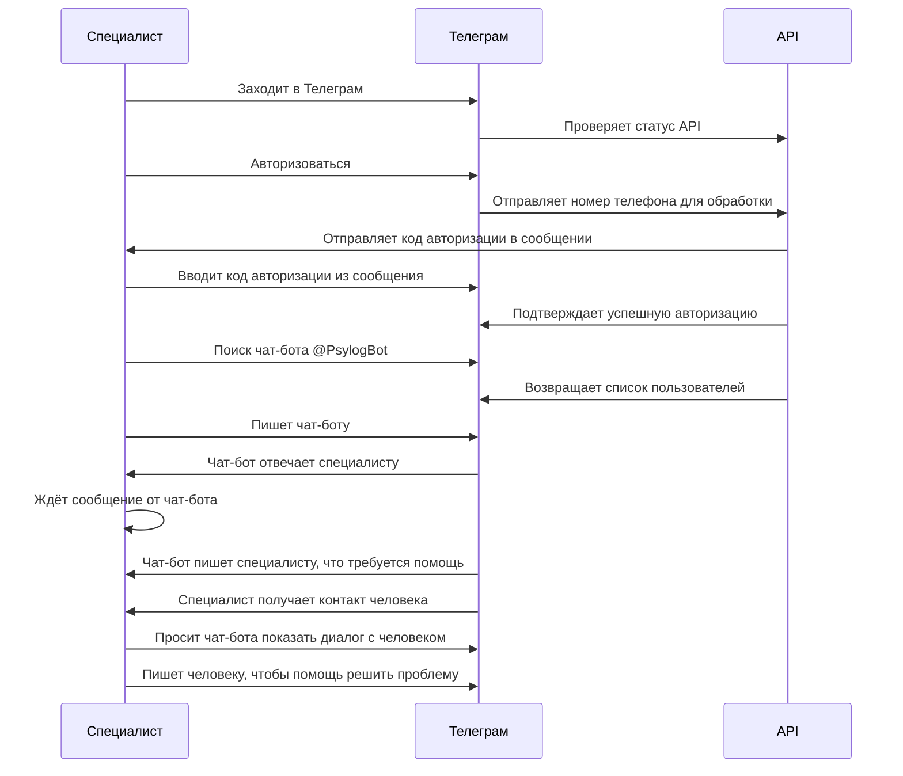

# Диаграмма последовательности

## Предусловия

- Чат-бот онлайн в Телеграм
- Пользователь авторизован в Телеграм
- Специалист авторизован в Телеграм

## Постусловия

- Данные о завершённых диалогах чат-бота и пользователя получены
- Данные о завершённых диалогах чат-бота и пользователя сохранены

## Получение психологической помощи пользователем

### Текстовое описание

- Пользователь заходит в приложение Телеграм
- Телеграм отправляет запрос к API для проверки доступа в Интернет
- Авторизация в Телеграм по номеру телефона
- API отправляет сообщение с кодом авторизации
- Пользователь вводит код из сообщения для входа в свой аккаунт
- API подтверждает успешную авторизацию
- Пользователь в поиске ищет чат-бота @PsylogBot
- Формируется запрос к API
- API возвращает список пользователей
- Пользователь выбирает чат-бота и пишет ему сообщение
- Чат-бот отвечает пользователю, начат диалог
- Проблема пользователя решена, диалог завершён
    - API формирует JSON и выполняет SQL запрос в БД
- Пользователь может вызвать специалиста горячей линии, диалог завершён
    - API формирует JSON и выполняет SQL запрос в БД
- Чат-бот выявляет экстренный случай и уведомляет специалиста горячей линии, диалог завершён
    - API формирует JSON и выполняет SQL запрос в БД

### Диаграмма

## Оказание психологической помощи специалистом

### Текстовое описание

- Специалист заходит в приложение Телеграм
- Телеграм отправляет запрос к API для проверки доступа в Интернет
- Авторизация в Телеграм по номеру телефона
- API отправляет сообщение с кодом авторизации
- Специалист вводит код из сообщения для входа в свой аккаунт
- API подтверждает успешную авторизацию
- Специалист в поиске ищет чат-бота @PsylogBot, формируется запрос к API
- API возвращает список пользователей
- Специалист выбирает чат-бота и пишет ему сообщение, чтобы чат-бот мог ему написать в дальнейшем
- Специалист ждёт сообщение от чат-бота, когда понадобится его помощь
- Специалисту приходит сообщение от чат-бота, что требуется его помощь
- Специалист получает контакт человека, которому нужна помощь
- Специалист может попросить чат-бота показать диалог с этим человеком
- Специалист пишет человеку, чтобы решить возникшую проблему

### Диаграмма

