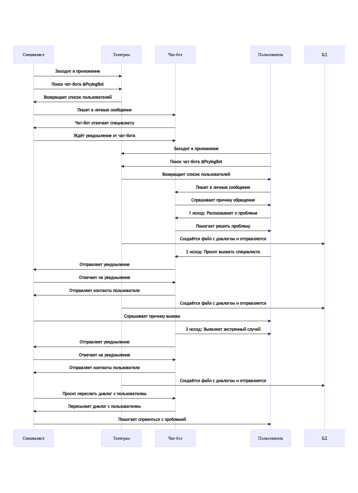

# Диаграмма последовательности

## Предусловия

- Чат-бот онлайн в Телеграм
- Пользователь авторизован в Телеграм
- Специалист авторизован в Телеграм

## Постусловия

- Пользователем получена психологическая помощь
- Данные о завершённых диалогах чат-бота и пользователя получены
- Данные о завершённых диалогах чат-бота и пользователя сохранены

## Получение психологической помощи

### Текстовое описание

- Специалист заходит в приложение Телеграм
- Специалист в поиске ищет чат-бота @PsylogBot
- Телеграм возвращает список пользователей
- Специалист выбирает чат-бота и пишет ему сообщение, чтобы чат-бот мог ему написать в дальнейшем
- Специалист ждёт уведомление от чат-бота, когда понадобится его помощь
- Пользователь заходит в приложение Телеграм
- Пользователь в поиске ищет чат-бота @PsylogBot
- Телеграм показывает список пользователей
- Пользователь выбирает чат-бота и пишет ему сообщение
- Чат-бот отвечает пользователю, начат диалог
- Проблема пользователя решена, диалог завершён
    - Создаётся файл с диалогом и отправляется в базу данных
- Пользователь может вызвать специалиста горячей линии, диалог завершён
    - Создаётся файл с диалогом и отправляется в базу данных
- Специалисту приходит уведомление от чат-бота, что требуется его помощь
- Специалист получает контакт человека, которому нужна помощь
- Специалист пишет человеку, чтобы решить возникшую проблему
- Чат-бот выявляет экстренный случай, диалог завершён
    - Создаётся файл с диалогом и отправляется в базу данных
- Специалисту приходит уведомление от чат-бота, что требуется его помощь
- Специалист получает контакт человека, которому нужна помощь
- Специалист может попросить чат-бота показать диалог с этим человеком
- Специалист пишет человеку, чтобы решить возникшую проблему

### Диаграмма

